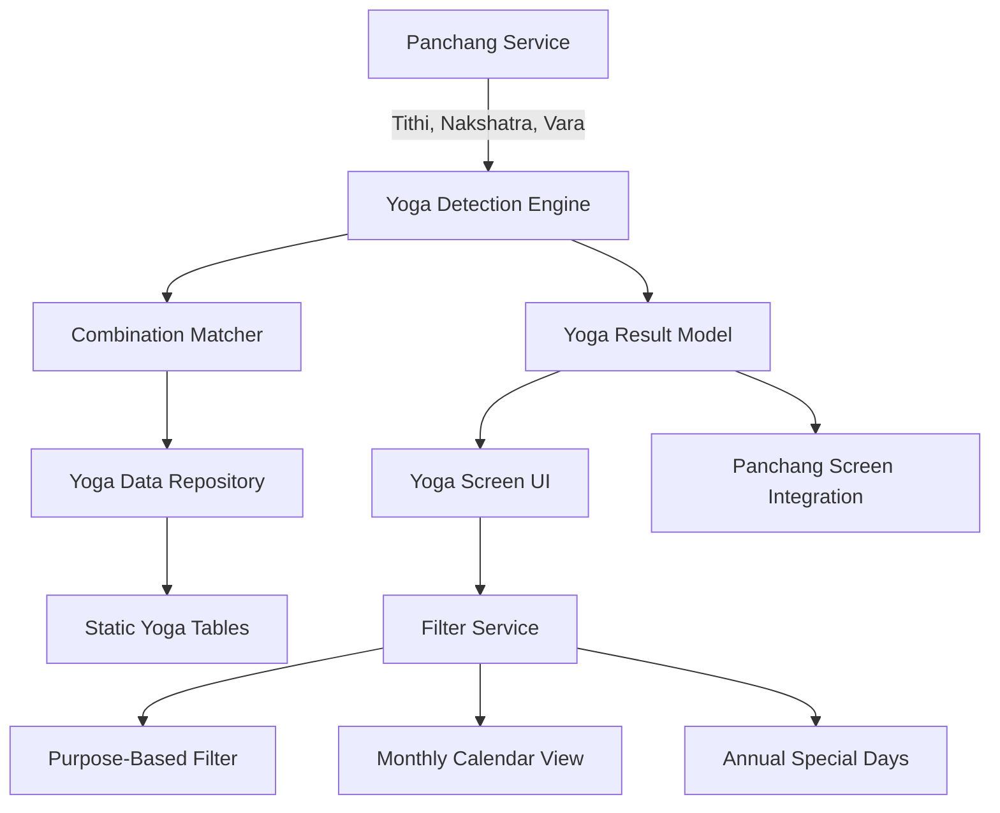

# Design Document: Vedic Special Combinations (Yogas)

## Overview

This feature implements detection and display of special auspicious and inauspicious Vedic astrology combinations (yogas) formed by the interaction of Tithi (lunar day), Nakshatra (lunar constellation), and Vara (weekday). The system will calculate 10 major yoga types including Amrit Siddhi, Siddha, Sarvartha Siddhi, Guru Pushya, and inauspicious combinations like Dagdha Tithi and Visha Yoga. Users can view active yogas for any date, filter by purpose (marriage, business, education, travel), and see monthly/annual special days.

## Architecture



## Main Algorithm/Workflow

```mermaid
sequenceDiagram
    participant UI as Yoga Screen
    participant Engine as Yoga Detection Engine
    participant Panchang as Panchang Service
    participant Matcher as Combination Matcher
    participant Repo as Yoga Data Repository
    
    UI->>Engine: detectYogas(date, location)
    Engine->>Panchang: getPanchang(date, location)
    Panchang-->>Engine: {tithi, nakshatra, vara}
    Engine->>Matcher: matchAmritSiddhi(tithi, vara, nakshatra)
    Matcher->>Repo: getAmritSiddhiTable()
    Repo-->>Matcher: combinations[]
    Matcher-->>Engine: yogaResults[]
    Engine->>Matcher: matchSiddha(tithi, vara, nakshatra)
    Matcher->>Repo: getSiddhaTable()
    Repo-->>Matcher: combinations[]
    Matcher-->>Engine: yogaResults[]
    Engine->>Matcher: matchDagdha(tithi, vara)
    Matcher->>Repo: getDagdhaTable()
    Repo-->>Matcher: combinations[]
    Matcher-->>Engine: yogaResults[]
    Engine-->>UI: List<YogaResult>
    UI->>UI: displayYogas(results)
